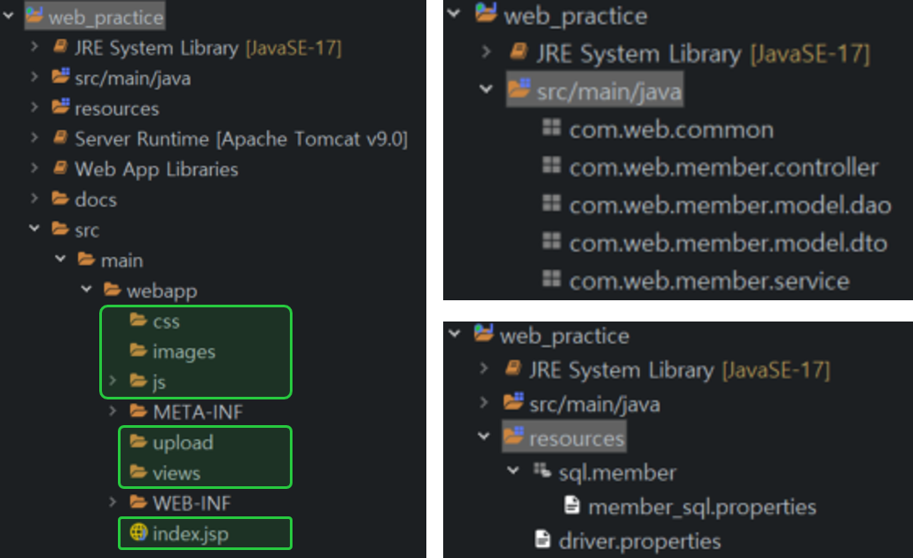
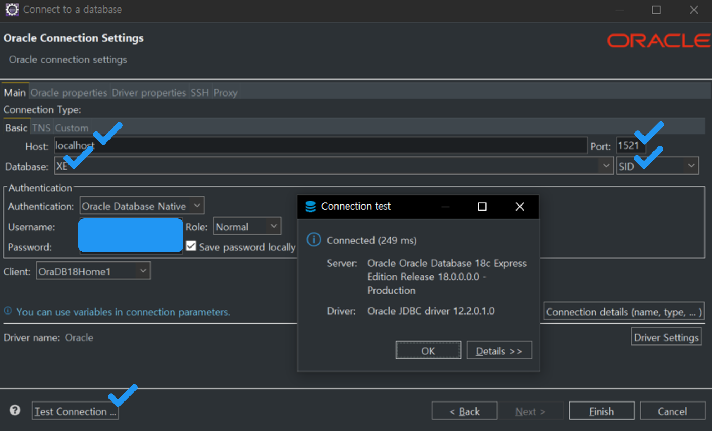

# WEB PRACTICE
> JSP (view) & Servlet (controller) & JDBC (model)의 삼각편대로 웹 서비스를 만들어보자.
<br>

## 프로젝트 세팅⚙
### 인코딩
이클립스에서 Window > Preferences 클릭
- General > Workspace > Text file encoding 항목에서 UTF-8 설정
- General > Editors > Text Editors > Spelling의 Encoding 항목에서 UTF-8 설정
- Web의 <i>**CSS Files, HTML Files, JSP Files**</i> 메뉴에서 UTF-8 설정

### 프로젝트 생성
- Dynamic Web Project로 생성
- Source folders on build path: java 파일이 저장되는 곳
- Default output folder: class 파일이 저장되는 곳으로 <i>**src\main\webapp\WEB-INF\classes**</i>으로 지정

### 프로젝트 구성
<p align="center">
    
</p>

- jsp 파일은 webapp 폴더에 배치하며 (`index.jsp`가 메인 페이지) 관련 폴더도 같은 경로에 배치
- 서블릿을 비롯한 java 파일은 기능별로 나눠서 패키지에 보관
- DB 접속 및 SQL 실행에 필요한 properties 파일은 <i>**resources**</i> 폴더를 만들어 이곳에 보관 (`.gitignore`에 추가하기)
	- 사진을 보면 resources가 프로젝트 바로 밑에 있는데 권장 경로는 <i>**src/main/resources**</i>😅

모든 웹 서비스는 <i>**서블릿 > jsp**</i> 순으로 제공되어야 한다. 서블릿을 거치지 않고 바로 jsp로 접근하면 안 된다. jsp 파일은 추후 WEB-INF 폴더에 보관할 예정인데 이 폴더는 외부에서 접근 불가능하기 때문에 jsp 파일을 직접 호출할 수 없다.
		
### sample DB
```sql
CREATE TABLE MEMBER (
  USERID VARCHAR2(15) PRIMARY KEY, 
  PASSWORD VARCHAR2(15) NOT NULL, 
  USERNAME  VARCHAR2(20) NOT NULL, 
  GENDER CHAR(1) CHECK (GENDER IN ('M','F')), 
  AGE NUMBER,
  EMAIL VARCHAR2(30), 
  PHONE CHAR(11)  NOT NULL, 
  ADDRESS VARCHAR2(100), 
  HOBBY VARCHAR2(50),
  ENROLLDATE DATE DEFAULT SYSDATE
);
```
<p align="center">
    
</p>

- 이클립스에서 DBeaver 플러그인을 설치하면 sqldevloper를 열지 않고도 오라클 DB에 접속할 수 있음
- Auto Commit에서 Manual Commit으로 변경하기

### 라이브러리
- `ojdbc.jar`는 <i>**src/main/webapp/WEB-INF/lib**</i>에 추가
- lombok도 추가할 경우
    - [Maven Repository](https://mvnrepository.com/)에서 lombok 다운로드
    - 다운 받은 lombok이 있는 폴더에서 shift + 우클릭 후 <i>**PowerShell**</i> 열기
    - `java -jar lombok-1.18.24.jar`처럼 lombok 파일명을 기입해 Installer 실행
    - Can't find IDE가 뜬다면 Specify location 버튼을 눌러 이클립스가 설치된 폴더로 가서 `eclipse.exe`를 선택
    - 설치가 끝나면 lombok 파일도 `ojdbc.jar`와 같은 경로에 추가

## 기능 목록📃
| 기능 | 요약 |
| ------ | ------ |
| [1. 메인페이지](./docs/FEAT1_main.md) | 페이지 구성 시 공통 요소에 대해 별도의 jsp 파일로 분리 |
| [2. 로그인](./docs/FEAT2_login.md) | 로그인 성공과 실패에 따라 달라지는 세션 데이터 및 화면 구현 |
| [3. 로그아웃 & 아이디 및 비밀번호 유효성 검사](./docs/FEAT3_logout.md) | 로그아웃 시 세션 삭제 & 간단한 유효성 검사는 프론트에서 처리 |
| [4. 아이디 저장](./docs/FEAT4_saveid.md) | 쿠키를 이용한 아이디 저장 |