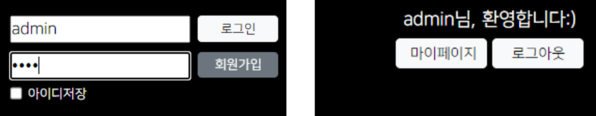

## 2. 로그인
<p align="center">
          
</p>

- 클라이언트가 서버한테 아이디와 비밀번호를 전달
- 서버는 클라이언트가 보낸 아이디와 비밀번호를 갖고 DB에 접속해 일치하는 정보가 있는지 조회
- 일치하는 정보가 있으면 로그인 성공, 없으면 실패
<br><br>

```jsp
<%@ page language="java" contentType="text/html; charset=UTF-8"
  pageEncoding="UTF-8"%>
<header class="px-3 py-3">
  <!-- 생략 -->
    <form action="<%= request.getContextPath() %>/login.do" method="post">
      <div class="account d-flex justify-content-between">
        <div class="account_left d-flex flex-column justify-content-between me-2">
          <div>
            <input id="userId" name="userId" placeholder="ID">
          </div>
          <div>
            <input type="password" id="userPw" name="userPw" placeholder="PW">
          </div>
        </div>
        <div class="account_right d-flex flex-column justify-content-between">
          <div>
            <input type="submit" class="btn btn-light" value="로그인">
          </div>
          <div>
            <input type="button" class="btn btn-secondary" value="회원가입">
          </div>
        </div>
      </div>
      <!-- 생략 -->
    </form>
  <!-- 생략 -->
</header>
```
<p align="right"><code>header.jsp</code> 중 일부</p>

로그인 버튼을 누르면 사용자가 입력한 아이디와 비밀번호가 서버로 전송되야 하므로, 로그인 버튼의 타입을 submit으로 지정하고 `<form>`의 action 속성에는 전달받을 서블릿의 맵핑된 url을 적는다. (`<%= request.getContextPath() %>/login.do`) 아이디와 비밀번호는 외부에 노출되면 안 되기에 method 속성은 post로 지정한다.
<br><br>

```java
@WebServlet("/login.do")
public class LogInServlet extends HttpServlet {
  // 생략

  protected void doGet(HttpServletRequest request, HttpServletResponse response) 
      throws ServletException, IOException 
  {
    // 생략
    
    Member member = new MemberService().selectByAccount(userId, userPw);
    
    if (member != null) {
    	// 로그인 성공
      request.getSession().setAttribute("memberLoggedIn", member);
      response.sendRedirect(request.getContextPath());
    } else {
    	// 로그인 실패
      request.setAttribute("msg", "아이디 또는 비밀번호가 일치하지 않습니다.");
      request.setAttribute("loc", "/");
      request.getRequestDispatcher("/views/common/msg.jsp").forward(request, response);
    }
  }
  
  // doPost() 생략
}
```
<p align="right"><code>LogInServlet.java</code></p>

`/login.do`로 맵핑된 로그인 서블릿이다. 클라이언트가 입력한 아이디와 비밀번호를 변수 userId와 userPw에 할당한 뒤, 이를 가지고 DB에 접속해 일치하는 정보를 찾는다. (관련 서비스 및 JDBC 로직은 생략) 조회한 결과는 Member 타입의 변수인 member에 담는다. 이 변수의 결과는 null이냐 아니냐로 갈린다.
<br><br>

### 1️⃣ 변수 member가 null이 아닌 경우
이는 일치하는 정보가 있다는 얘기이므로 로그인 성공을 뜻한다. 이때 로그인된 정보 (변수 member)는 로그아웃할 때까지 유지돼야 한다. **원하는 기간 동안 데이터가 유지돼야 하므로 세션에 저장하는 것이 좋다.** (사용자별로 세션 ID가 다르게 부여되기 때문에 각자 매칭된 로그인 정보가 세션에 저장됨) 여기서 세션은 없으면 만들어서라도 부여해야 하기 때문에 false 없이 `request.getSession()`으로 세션을 가져온다.
<br>

💡 사실 메인 페이지가 jsp로 돼있고, 지시자 태그에서 session 속성을 false로 지정하지 않았기 때문에 자동으로 세션이 생성된다. 그러므로 로그인 서블릿에서 `request.getSession()`의 false 여부를 고려하지 않아도 된다.
<br>

가져온 세션에 로그인된 정보를 담고 메인 페이지로 전환해야 하는데 이때 dispatcher가 아니라 redirect 방식을 이용한다. 이미 세션에 데이터를 담았기 때문에 request로 받은 데이터는 필요없다. **그리고 dispatcher를 쓰면 화면은 메인 페이지를 가리키지만 url은 여전히** `/login.do`**에 머물러 있기 때문에 이 상태에서 F5를 누르면 로그인 로직이 반복되는 꼴이다.** 리소스 낭비~
<br><br>

### 2️⃣ 변수 member가 null인 경우

이는 로그인 실패를 의미하기 때문에 새로운 페이지에서 실패 메세지를 띄운 다음 다시 메인 페이지로 이동한다. 메세지를 띄우는 페이지는 재사용될 수 있으므로 공용 페이지를 활용하는 편이 좋다. 공용 페이지로 이동할 땐 일회용 정보 (실패 메세지, 공용 페이지에서 마지막으로 도달할 곳의 url)만 보내기 때문에 dispatcher 방식을 따르면 된다. 실패 메세지는 request의 "msg" 속성에, 최종적으로 이동할 곳 (메인 페이지이므로 "/"만 입력)의 url은 "loc" 속성에 저장한다.
<br><br>

```jsp
<%@ page language="java" contentType="text/html; charset=UTF-8"
  pageEncoding="UTF-8"%>
<%
  // request.setAttribute()에 담긴 값은 Object로 저장되기 때문에 꺼낼 때 타입 캐스팅 필요
  String msg = (String) request.getAttribute("msg");
  String loc = (String) request.getAttribute("loc");
%>
<!DOCTYPE html>
<html>
<head>
<meta charset="UTF-8">
<title>시스템 메세지</title>
</head>
<body>
  <script>
    alert("<%= msg %>");
    location.replace("<%= request.getContextPath() %><%= loc %>");
  </script>
</body>
</html>
```
<p align="right"><code>msg.jsp</code></p>

이어서 <i>**src/main/webapp/views/common**</i>에서 공용 페이지로 쓸 jsp 파일을 만든다. 이 페이지는 request에 담긴 메세지를 출력한 뒤 지정된 페이지로 이동하는 역할을 하는데, 메세지 출력과 페이지 이동을 순차적으로 수행하는 방법은 JS를 이용하는 방법밖에 없다. 그렇다면 request에 저장된 메세지와 url을 JAVA 변수에 할당한 뒤, 이를 JS에서 불러와야 하는데 주의할 점이 있다. JS 코드에서 JAVA 코드를 사용할 땐 <i>**쌍따옴표**</i>로 감싸줘야 한다. 브라우저에 결과를 출력할 때 JAVA 코드는 이미 컴파일된 상태이기 때문에 이를 리터럴로 나타내기 위해선 쌍따옴표로 감싸야 한다. 그러지 않고 `alert(<%= msg %>)`처럼 JS 코드를 작성하면 `<%= msg %>` 부분이 리터럴이 아니라 JS 변수로 인식되기 때문에 에러가 발생한다! 아울러 실패 메세지를 띄우고 최종 페이지로 이동했을 때 이전 페이지로 돌아가면 안 되므로 JS의 `location.replace()` 메소드를 이용한다. 이 메소드에 매개값을 넣을 때도 JAVA코드가 들어가니 쌍따옴표로 감싸주도록 하자.
<br><br>

```jsp
<%@ page language="java" contentType="text/html; charset=UTF-8"
    pageEncoding="UTF-8"%>
<%@ page import="com.web.member.model.dto.Member" %>
<%
  Object obj = session.getAttribute("memberLoggedIn");
  Member memberLoggedIn = null;
  
  if (obj != null) {
    memberLoggedIn = Member.class.cast(obj);
  }
%>
```
<p align="right"><code>header.jsp</code> 중 일부</p>

로그인이 성공 및 실패를 판별할 수 있다면 메인 페이지의 모습도 로그인 시도 결과에 따라 달라져야 한다. 로그인이 성공했을 때는 메인 페이지의 로그인창이 대신 다른 요소를 띄워야 한다. 몇 가지 절차가 필요한데 우선 메인 페이지에서 세션에 담긴 로그인 정보를 가져와 Member 타입의 변수 memberLoggedIn에 할당한다. 세션에 담긴 로그인 정보가 존재한다면 이 변수는 null 아닐테고, 그렇지 않다면 여전히 null을 유지할 것이다.
<br><br>

```jsp
<% if (memberLoggedIn == null) { %>
  <!-- 로그인 실패 -->
  <form action="<%= request.getContextPath() %>/login.do" method="post">
    <!-- 아이디 입력칸, 비밀번호 입력칸, 로그인 버튼, 회원가입 버튼 -->
  </form>
<% } else { %>
  <!-- 로그인 성공 -->
  <div class="d-flex flex-column justify-content-between">
    <p class="mb-0 text-center"><%= memberLoggedIn.getUserId() %>님, 환영합니다:)</p>
    <div class="account_right d-flex justify-content-between" style="width:165px">
      <div>
        <input type="button" class="btn btn-light" value="마이페이지">
      </div>
      <div>
        <input type="button" class="btn btn-light" value="로그아웃">
      </div>
    </div>
  </div>
<% } %>
```
<p align="right"><code>header.jsp</code> 중 일부</p>

그리고 HTML 태그가 적힌 곳에서 분기 처리를 해준다. 상단의 스크립틀릿 태그에서 선언한 변수 memberLoggedIn이 null이면 `<form>`이 뜨게 하고, 그렇지 않으면 로그인 계정과 관련된 요소가 뜨게 한다. 여기서 'xxx님, 환영합니다:)'라는 문구가 있고 앞에 아이디를 넣어야 하는데, 이는 세션에 담긴 로그인 정보에서 가져오면 된다.