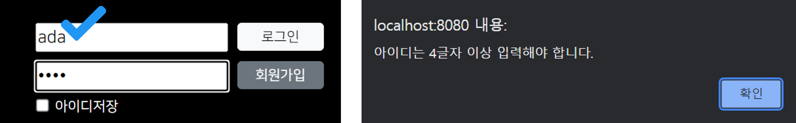

## 3. 로그아웃 & 아이디 및 비밀번호 유효성 검사
### 로그아웃

```jsp
<% if (memberLoggedIn == null) { %>
  <form>
    <!-- 로그인 창 -->
  </form>
<% } else { %>
  <div class="d-flex flex-column justify-content-between">
    <p class="mb-0 text-center"><%= memberLoggedIn.getUserId() %>님, 환영합니다:)</p>
    <div class="account_right d-flex justify-content-between" style="width:165px">
      <div>
        <input type="button" class="btn btn-light" value="마이페이지">
      </div>
      <div>
        <input type="button" class="btn btn-light" value="로그아웃" 
               onclick="location.replace('<%= request.getContextPath() %>/logout.do')">
      </div>
    </div>
  </div>
<% } %>
```
<p align="right"><code>header.jsp</code> 중 일부</p>

로그아웃 버튼 클릭 시 onclick 이벤트를 발동 시켜, JS 메소드를 호출한다. JS를 통해 요청을 보내야 하고, 이전 페이지로 돌아가면 안 되기 때문에 `location.replace()` 메소드를 쓰는 편이 좋다.
<br><br>

```java
@WebServlet("/logout.do")
public class LogOutServlet extends HttpServlet {
  private static final long serialVersionUID = 1L;
       
  public LogOutServlet() {}
  
  protected void doGet(HttpServletRequest request, HttpServletResponse response) 
      throws ServletException, IOException 
    {
      request.getSession().invalidate();
      response.sendRedirect(request.getContextPath());
    }
    
  // doPost() 생략
}

```
<p align="right"><code>LogOutServlet.java</code></p>

`/logout.do`로 맵핑된 로그아웃 서블릿이다. 로그인된 사용자를 로그아웃 시키기 위해선 **세션을 삭제해야 한다.** (`request.getSession().invalidate()`) 세션에 저장된 로그인 데이터만 삭제하는 것보단 세션 자체를 삭제하는 쪽이 메모리 관리면에서 더 효율적이다. 삭제가 끝났다면 메인 화면으로 이동하면 되는데 이때 포워딩하지 않고 리디렉션 방식을 따라야 한다. request 객체를 굳이 유지할 필요도 없는 데다 포워딩 방식을 따르면 url이 `logout.do`로 유지된다.
<br><br>

### 아이디 및 비밀번호 유효성 검사
<p align="center">
    
</p>

```jsp
<form action="<%= request.getContextPath() %>/login.do" method="post" 
      onsubmit="return validateAccount();">
  <div>
    <!-- 생략 -->
    <div class="account_right d-flex flex-column justify-content-between">
      <div>
        <input type="submit" class="btn btn-light" value="로그인">
      </div>
      <div>
        <input type="button" class="btn btn-secondary" value="회원가입">
      </div>
    </div>
  </div>
  <!-- 생략 -->
</form>
```
<p align="right"><code>header.jsp 중 일부</code></p>

로그인 시 아이디나 비밀번호가 일정 글자 수 이상인지를 검증하는 기능은 굳이 서버에서 맡지 않고 프론트에서 처리하는 게 효율적이다. `<form>`에 있는 로그인 버튼의 타입이 submit이라서 버튼 클릭 시 무조건 전송이 이루어지기 때문에 `<form>`에 <i>**onsubmit 이벤트**</i>를 부여해 유효성 검사를 통과할 때만 전송되도록 설정한다.

```jsp
<script>
  const validateAccount = () => {
    const id = $('#userId').val();
    const pw = $('#userPw').val();
    
    if (id.length < 4) {
      alert('아이디는 4글자 이상 입력해야 합니다.');
      $('#userId').focus();
      return false;
    }
	
    if (pw.length < 4) {
      alert('비밀번호는 4글자 이상 입력해야 합니다.');
      $('#userId').focus();
      return false;
    }
  };
</script>
```
<p align="right"><code>header.jsp 중 일부</code></p>

유효성 검사를 수행하는 JS 메소드이다. 아이디와 비밀번호 입력값에 대해 지정된 글자 수를 넘지 않으면 false를 반환하도록 했고, 이는 `<form>`의 onsubmit 이벤트로 전달된다. 참고로 이 메소드를 보면 true에 대한 케이스가 없는데 어차피 onsubmit은 false일 때만 전송이 안 되고, true이거나 undefined일 때만 전송이 이루어지기 때문에 괜찮다.