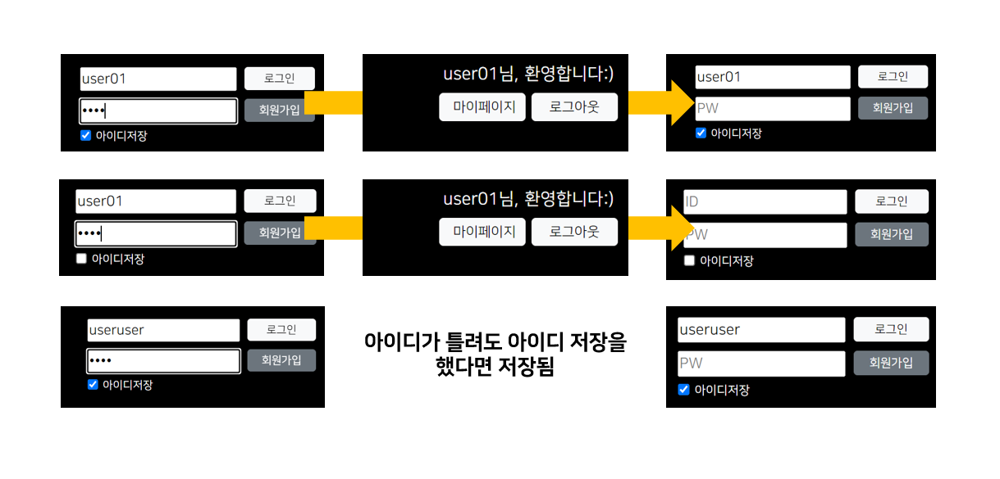

## 4. 아이디 저장
<p align="center">
    
</p>

- 로그인 시도 시 아이디 저장 여부를 확인
- 로그인 처리는 로그인 서블릿에서 이루어지므로 이곳에서 아이디 저장과 관련된 기능 구현
- 아이디 저장은 로그인 성패에 상관 없이 체크가 되면 기능 수행
<br><br>

```jsp
<!-- 생략 -->
  <form action="<%= request.getContextPath() %>/login.do" method="post" 
        onsubmit="return validateAccount();">
    <!-- 생략 -->
    <div class="d-flex align-items-center">
      <input type="checkbox" name="saveId" id="saveId">
      <label for="saveId">아이디저장</label>
    </div>
    <!-- 생략 -->
  </form>
<!-- 생략 -->
```
<p align="right"><code>header.jsp</code> 중 일부</p>

메인 페이지에서 아이디 저장 여부를 정하는 체크박스를 보면 **name 속성** (saveId)이 정의돼있다. submit 이벤트가 발생하면 이 체크박스도 request의 파라미터로 함께 전달되는데 어떤 값을 담겨 있을까?
<br><br>

```java
@WebServlet("/login.do")
public class LogInServlet extends HttpServlet {
  // 생략
  
  protected void doGet(HttpServletRequest request, HttpServletResponse response) 
      throws ServletException, IOException 
  {
    String userId = request.getParameter("userId");
    String userPw = request.getParameter("userPw");
    String saveId = request.getParameter("saveId"); // on 아니면 null을 반환
    
    if (saveId != null) {
      Cookie cookie = new Cookie("saveId", userId);
      cookie.setMaxAge(60 * 60 * 24 * 7);
      response.addCookie(cookie);
    } else {
      Cookie cookie = new Cookie("saveId", "");
      cookie.setMaxAge(0);
      response.addCookie(cookie);
    }
    
    // 로그인 처리 부분 생략
    }

	// doPost() 생략
}
```
<p align="right"><code>LogInServlet.java</code></p>

서블릿 `/login.do`에서 체크박스의 반환값을 변수 saveId에 할당한 뒤 프린트 메소드로 출력하면 **null** 또는 '**on**'이 나온다. 우선 null의 경우 체크박스가 체크되지 않을 때 반환되는 값이다. 그러나 체크가 되면 원래는 체크박스의 value 속성에 정의한 값이 반환된다. 근데 여기서는 체크 박스의 value 속성을 지정하지 않았기 때문에 디폴트로 'on'이 반환된다.
<br><br>

그렇다면 체크박스의 반환값이 null이냐 아니냐로 아이디 저장 여부를 판별할 수 있다. 우선 null이 아니라면 아이디를 저장했다는 얘기이다. 그렇다면 사용자가 입력한 아이디를 어딘가에 보관해야 한다. 또한 이 보관된 아이디는 어떤 페이지로 이등하든, 페이지를 껐다 키든 유지되어야 하니 세션이나 쿠키에 보관하는 게 좋다. 근데 중요한 정보는 아니니 보통은 쿠키에 저장한다. 저장할 아이디를 매개값으로 Cookie 객체를 생성한 뒤 `setMaxAge()` 메소드로 기간을 설정한다. 그리고 `response.addCookie()` 메소드에 Cookie 객체를 담아준다.
<br><br>

체크박스의 반환값이 null인 경우, 아이디 저장을 하지 않았다는 의미이므로 아이디가 보관된 쿠키를 지워야 한다. 특정 쿠키를 지울 땐 생성 당시 넣은 매개값을 공백으로 처리한 후 `setMaxAge()` 메소드의 기간을 0으로 잡는 식으로 처리한다.
<br><br>

아이디를 저장하는 기능은 로그인 성패에 상관없이 진행되어야 한다. 따라서 로그인 처리하는 코드보다 앞에 있어야 한다. 로그인 처리가 끝나면 클라이언트한테 결과가 전달되기 때문에 응답이 이루어지고 나서 쿠키에 아이디를 저장해봤자 반영되지 않는다.
<br><br>

```jsp
<%@ page language="java" contentType="text/html; charset=UTF-8"
    pageEncoding="UTF-8"%>
<%@ page import="com.web.member.model.dto.Member, java.util.Arrays" %>
<%
  // 로그인 계정을 저장하는 부분 생략
  
  String saveId;
  Cookie[] cookies = request.getCookies();
  saveId = Arrays.stream(cookies)
                .filter(cookie -> cookie.getName().equals("saveId"))
                .findFirst()
                .map(cookie -> cookie.getValue())
                .orElse("");
%>
<header>
  <!-- 생략 -->
  <form action="<%= request.getContextPath() %>/login.do" method="post" 
      onsubmit="return validateAccount();">
    <div class="account d-flex justify-content-between">
      <div class="account_left d-flex flex-column justify-content-between me-2">
        <div>
          <input id="userId" name="userId" placeholder="ID" value="<%= saveId %>">
        </div>
        <!-- 생략 -->
      </div>
      <!-- 생략 -->
    </div>
    <div class="d-flex align-items-center">
      <input type="checkbox" name="saveId" id="saveId" <%= saveId.equals("") ? "" : "checked" %>>
      <label for="saveId">아이디저장</label>
    </div>
    <!-- 생략 -->
  </form>
  <!-- 생략 -->
</header>
```
<p align="right"><code>header.jsp</code> 중 일부</p>

자, 아직 한 발 남았다. 아이디 저장을 했다면 로그아웃했을 때 아이디 칸에 저장된 아이디가 입력되어 있어야 한다. (로그인에 실패했을 때도 마찬가지) 그렇다면 앞서 쿠키에 보관한 아이디를 불러와야 한다. 상단의 선언문 태그에서 저장한 아이디를 담을 변수 saveId를 선언한다. 그런 다음 `request.getCookies()` 메소드를 이용해 쿠키를 불러오는데 쿠키는 하나만 있는 게 아니라서 반환 타입이 객체 배열이다. 람다를 이용해 키가 saveId인 쿠키를 찾아서 있으면 밸류를 변수 saveId에 할당하고 아니면 공백을 할당한다. 할당 작업이 끝나면 변수 saveId는 **아이디 입력칸의 value**와 **아이디 저장 체크박스의 분기 처리용**으로 쓰인다. 체크박스에선 변수 saveId의 값이 공백이면 공백을 그렇지 않으면 checked를 반환하게 한다. 이런 식으로 `<input>`의 속성을 정의할 수 있으니 기억해두자. 끝!