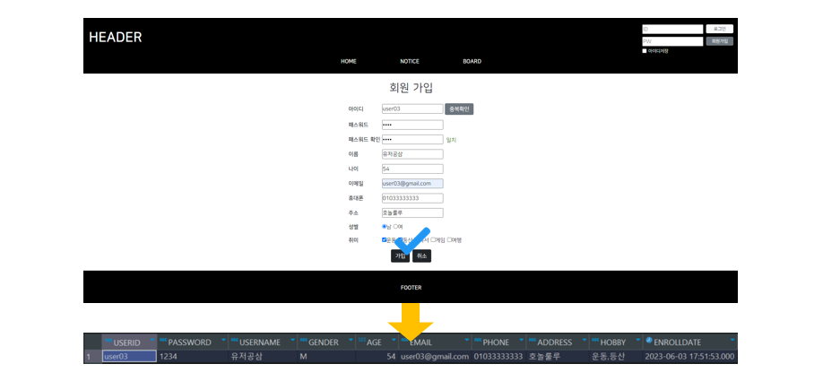
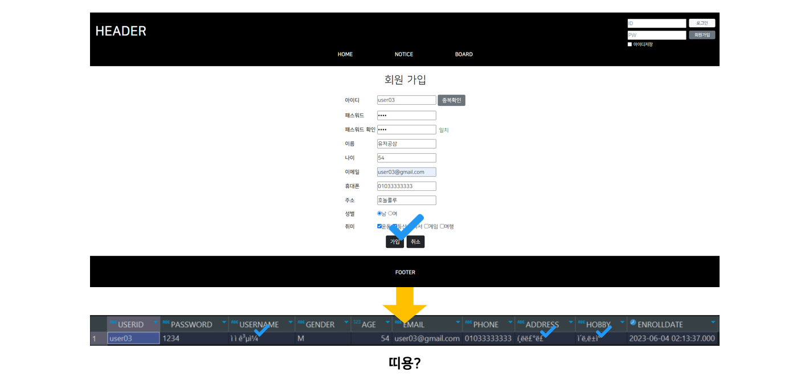
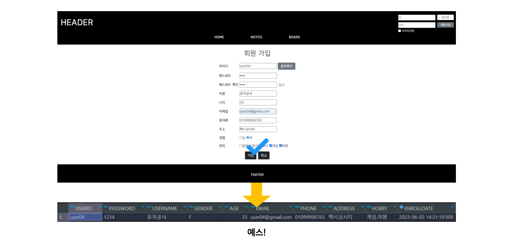

## 5. 회원가입 1
### 회원 정보 등록
<p align="center">
    
</p>

- 사용자는 회원가입에 필요한 정보를 기입한 후 가입 버튼을 클릭한다.
- 아이디와 비밀번호가 조건에 맞게 입력되지 않았다면 입력 조건이 충족되지 않았다는 경고 메시지를 띄운다. (회원가입 2에서 진행)
- 조건에 맞게 모든 아이디와 비밀번호가 입력됐다면, 가입 정보와 함께 서버로 요청이 전달된다.
- 서버는 클라이언트가 보낸 가입 정보를 가지고 DB의 회원 테이블에 새로운 회원 정보를 등록한다.
- 등록이 성공하면 메인 페이지로, 등록이 실패하면 다시 회원가입 페이지로 이동한다.
<br><br>

```jsp
<form action="<%= request.getContextPath() %>/login.do" method="post" onsubmit="return validateAccount();">
  <!-- 생략 -->
    <div class="account_right d-flex flex-column justify-content-between">
      <div>
        <input type="submit" class="btn btn-light" value="로그인">
      </div>
      <div>
        <input type="button" class="btn btn-secondary" value="회원가입" 
               onclick="location.assign('<%= request.getContextPath() %>/member/enrollMember.do');">
      </div>
    </div>
  <!-- 생략 -->
</form>
```
<p align="right"><code>header.jsp</code>중 일부</p>

```java
@WebServlet("/member/enrollMember.do")
public class EnrollMemberServlet extends HttpServlet {
  // 생략
  
  protected void doGet(HttpServletRequest request, HttpServletResponse response) 
      throws ServletException, IOException 
  {
    // 회원가입 페이지로 이동
    request.getRequestDispatcher("/views/member/enrollMember.jsp").forward(request, response);
  }
  
  // doPost() 생략
}
```
<p align="right"><code>EnrollMemberServlet.java</code></p>

메인 페이지에서 회원가입 버튼을 클릭하면 **회원가입 화면으로 연결하는 서블릿으로 거친 뒤 회원가입 페이지로 이동**하도록 설정한다. click 이벤트 발생 시 JS의 `location.assign()` 메소드를 이용해 연결 서블릿으로 이동하도록 했다. `location.assign()` 메소드를 사용하면 이전 페이지에 대한 히스토리가 남지만 여기선 보안 상 숨겨야 할 데이터가 없으므로 괜찮다.
<br><br>

```jsp
<form action="<%=request.getContextPath()%>/member/enrollMemberEnd.do" method="post">
  <table>
    <!-- 생략 -->
    <tr>
      <th>성별</th>
      <td>
        <input type="radio" name="gender" id="gender0" value="M"><label for="gender0">남</label> 
        <input type="radio" name="gender" id="gender1" value="F"><label for="gender1">여</label>
      </td>
    </tr>
    <tr>
      <th>취미</th>
      <td>
        <input type="checkbox" name="hobby" id="hobby0" value="운동"><label for="hobby0">운동</label>
        <input type="checkbox" name="hobby" id="hobby1" value="등산"><label for="hobby1">등산</label> 
        <input type="checkbox" name="hobby" id="hobby2" value="독서"><label for="hobby2">독서</label>
        <input type="checkbox" name="hobby" id="hobby3" value="게임"><label for="hobby3">게임</label> 
        <input type="checkbox" name="hobby" id="hobby4" value="여행"><label for="hobby4">여행</label>
      </td>
    </tr>
  </table>
  <div class="d-flex justify-content-center">
    <input type="submit" value="가입" class="btn btn-dark mx-1">
    <input type="reset" value="취소" class="btn btn-dark mx-1">
  </div>
</form>
```
<p align="right"><code>enrollMember.jsp</code>중 일부</p>

회원가입 페이지로 이동하면 사용자는 이곳에서 가입 정보를 입력할 것이다. 이때 여러 타입의 `<input>`이 사용되는데 체크박스나 라디오버튼에 대해선 value를 미리 지정해줘야 한다. 안 그러면 `request.getParameter()` 메소드로 정보를 받을 때 'on'이 반환된다.
<br><br>

💡현재 `<form>` 안에 `<table>`이 쓰였는데 이런 식으로 쓰면 안 된다. 그치만 연습이기도 하고... 귀찮기도 하고...😗
<br><br>

사용자가 가입 정보를 모두 입력한 뒤 가입 버튼을 누르면 `<form>`의 action 속성에 적힌 회원가입 처리 서블릿으로 이동한다. 이때 POST 방식으로 요청이 이루어졌으니 가입 정보들은 HTTP Message의 body 영역에 담겨 서버로 전달된다.
<br><br>

```java
@WebServlet("/member/enrollMemberEnd.do")
public class EnrollMemberEndServlet extends HttpServlet {
  // 생략
  
  protected void doGet(HttpServletRequest request, HttpServletResponse response) 
    throws ServletException, IOException 
  {
    Member member = Member.builder()
                          .userId(request.getParameter("userId"))
                          .password(request.getParameter("password"))
                          .userName(request.getParameter("userName"))
                          .gender(request.getParameter("gender"))
                          .age(Integer.parseInt(request.getParameter("age")))
                          .email(request.getParameter("email"))
                          .phone(request.getParameter("phone"))
                          .address(request.getParameter("address"))
                          .hobby(request.getParameterValues("hobby"))
                          .build();
                          
    int result = new MemberService().enrollMember(member);
    String msg = "회원가입을 축하드립니다!";
    String loc = "/";
    
    if (result == 0) {
      msg = "회원가입에 실패했습니다.";
      loc = "/member/enrollMember.do";
    }
		
    request.setAttribute("msg", msg);
    request.setAttribute("loc", loc);
    request.getRequestDispatcher("/views/common/msg.jsp").forward(request, response);
  }
 
  // doPost() 생략
}
```
<p align="right"><code>EnrollMemberEndServlet.java</code></p>

회원가입 처리 서블릿에선 request 객체에 담긴 가입 정보를 꺼내 Member 타입의 변수 member에 담는다. 이 변수는 비즈니스 로직 (DB의 회원 테이블에 INSERT)을 수행하기 위한 매개변수로 쓰인다. 로직 결과는 변수 result에 할당되는데 **이 값이 0이면 등록에 실패한 거고, 그렇지 않으면 등록에 성공했다는 의미이다.** 각 케이스에 따라 사용자에게 보여줄 메세지와 이동할 주소를 정한 뒤, `request.setAttribute()` 메소드를 이용해 request 객체에 담고 공용 페이지로 포워딩한다.
<br><br>

💡등록 실패 시 이동할 주소를 `/member/enrollMember.do`로 잡았는데 지금까지 `request.getDispatcher()` 메소드로만 페이지 이동을 해서 `request.getRequestURI()` 메소드로 지정해도 `/web_practice/member/enrollMember.do`가 잡힌다. 다만 공용 페이지 (`msg.jsp`)에서 `loaction.replace()` 메소드에 매개값을 넣을 때 `<%= request.getContextPath() %>`를 앞에 써가지고, `request.getRequestURI()`와 합치면 URL이 `/web_practice/web_practice/member/enrollMember.do`가 돼버린다.
<br><br>

### 인코딩
<p align="center">
    
</p>

자, 이제 회원가입을 한 뒤 DB를 확인해보자. 으잉? 저장된 데이터가 이상하다. 영어는 잘 나오는데 한글로 쓴 부분이 깨져서 나온다. 이는 웹 브라우저에서 전달 받은 데이터의 문자셋 서버의 문자셋과 달라서 그렇다. 데이터의 문자셋을 UTF-8로 통일하면 해결된다.
<br><br>

```java
@WebFilter("/*")
public class EncodingFilter extends HttpFilter implements Filter {
  // 생략
  
  public void doFilter(ServletRequest request, ServletResponse response, FilterChain chain) 
      throws IOException, ServletException 
  {
    // 인코딩
    request.setCharacterEncoding("UTF-8");
    response.setCharacterEncoding("UTF-8");
    chain.doFilter(request, response); // 마무리!
  }
    
  // 생략
}
```
<p align="right"><code>EncodingFilter.java</code></p>


그런데 클라이언트와 서버가 데이터를 주고 받는 일은 거의 모든 곳에서 발생하기 때문에 인코딩 역시 모든 서블릿에 적용돼야 한다. 이럴 땐 필터 서블릿을 만들면 일괄 적용이 가능하다. 필터 생성 시 Filter mappings 항목에서 **URL pattern**을 선택하고 `/*`을 입력해 모든 서블릿에 적용되도록 한다. 이는 생성된 클래스의 애너테이션(`@WebFilter`)에서 확인할 수 있다. 참고로 필터 내부에서 돌아가는 로직은 `chain.doFilter()` 메소드로 마무리 해야 다음 서블릿으로 전환된다.
<br><br>

<p align="center">
    
</p>

좋았어! 이제 유효성 검사로 간다.