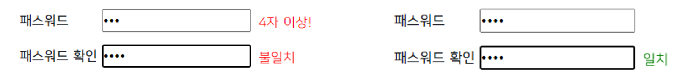
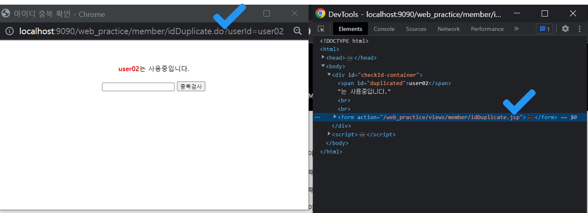

## 6. 회원가입 2
### 유효성 검사

```jsp
<form action="<%=request.getContextPath()%>/member/enrollMemberEnd.do" method="post">
  <table>
    <tr>
      <th>아이디</th>
      <td>
        <input type="text" placeholder="4글자이상" name="userId" id="idToUse"> 
        <input type="button" value="중복확인" onclick="validateDuplication();" class="btn btn-secondary py-1">
      </td>
    </tr>
    <tr>
      <th>패스워드</th>
      <td style="position: relative">
        <input type="password" name="password" id="passwordToUse" onkeyup="validatePwToUse(this);">
        <span class="warning-absolute"></span>
      </td>
    </tr>
    <tr>
      <th>패스워드 확인</th>
      <td style="position: relative">
        <input type="password" id="passwordToConfirm" onkeyup="validatePwToConfirm(this);">
        <span class="warning-absolute"></span>
      </td>
    </tr>
    <!-- 생략 -->
  </table>
  <div class="d-flex justify-content-center">
    <input type="submit" value="가입" onclick="return validateEnrollment();" class="btn btn-dark mx-1">
    <input type="reset" value="취소" class="btn btn-dark mx-1">
  </div>
</form>
```
<p align="right"><code>enrollMember.jsp</code>중 일부</p>

회원가입 페이지에서 사용자가 가입 버튼을 눌렀을 때, 아이디와 비밀번호의 유효한 경우에만 서버로 가입 정보가 전송될 수 있도록 설정했다. 이는 `<form>`의 onsubmit 이벤트를 이용해도 되지만 submit 타입인 `<input>`의 onclick 이벤트를 이용할 수도 있다.
<br><br>

```jsp
<script>
const userIdToUse = $('#idToUse');

// 플래그
let isIdValid = false;
let isPwValid = false;

const insertMsg = (selector, msg, color) => {
  $(selector).text(msg).css('color', color);
};

function setIdValid() {
  isIdValid = true;
}

// 플래그가 모두 true여야 통과
const validateEnrollment = () => {
  if (isIdValid == false || isPwValid == false) {
    alert('필수 입력 조건을 통과하지 못했습니다.');
    return false;
  }
};

const validatePwToUse = (selector) => {
  let color = '';
  let msg = '';
  
  if ($(selector).val().length < 4) {
    msg = ' 4자 이상!';
    color = 'red';
    isPwValid = false;
  } else {
    isPwValid = true;
  }
  insertMsg($(selector).next(), msg, color);
};

const validatePwToConfirm = (selector) => {
  let msg = ' 일치';
  let color = 'green';
  
  if ($(selector).val().length < 4) {
    msg = ' 불일치';
    color = 'red';
    isPwValid = false;
  } else {
    isPwValid = true;
  }
  insertMsg($(selector).next(), msg, color);
};
</script>
```
<p align="right"><code>enrollMember.jsp</code>중 일부</p>

가입 버튼 클릭시 JS의 `validateEnrollment()` 메소드가 호출된다. 이 메소드가 false를 반환하지 않기 위해선 변수 isIdValid와 isPwValid가 모두 true여야 한다. 각각은 아이디와 비밀번호의 유효성 여부를 따지는 플래그 역할을 한다. 비밀번호는 프론트에서 처리할 수 있지만 아이디는 서버에서 처리해야 한다. 비밀번호부터 확인해보자.
<br><br>

<p align="center">
    
</p>

비밀번호의 경우 일정 길이 이상인지 비밀번호 확인과 일치한지를 검사한다. 이 부분은 로그인에서 했던 것과 비슷하므로 생략! 비밀번호가 유효하다면 변수 isPwValid는 true로 바뀐다. 또한 시각적인 효과를 주기 위해 검사를 통과하지 못하면 경고 문구가 뜨도록 했다. (`insertMsg()`)
<br><br>

💡현재 `enrollMember.jsp`에는 `header.jsp`도 들어 있는 상태이다. `header.jsp`에서 아이디와 비밀번호를 입력하는 칸의 id 속성을 각각 userID와 userPw로 지정한 사실을 깜빡하고 `enrollMember.jsp`에서 아이디와 비밀번호를 입력하는 칸의 id 속성을 같은 값으로 지정하지 않도록 주의하자. `<script>`에서 변수명 지을 때도 마찬가지! 근데 여기선 name 속성의 값이 같아도 된다. 각각 연결된 `<form>`의 action 속성을 보면 도착하는 서블릿이 다르기 때문이다. 
<br><br>

```jsp
<form action="<%=request.getContextPath()%>/member/enrollMemberEnd.do" method="post">
  <table>
    <tr>
      <th>아이디</th>
      <td>
        <input type="text" placeholder="4글자이상" name="userId" id="idToUse"> 
        <input type="button" value="중복확인" onclick="validateDuplication();" class="btn btn-secondary py-1">
      </td>
    </tr>
    <!-- 생략 -->
  </table>
  <!-- 생략 -->
</form>
```
<p align="right"><code>enrollMember.jsp</code>중 일부</p>

```jsp
<script>
const validateDuplication = () => {
  if (userIdToUse.val().length < 4) {
    alert('아이디는 4글자 이상 입력하세요.');
    userIdToUse.focus();
  } else {
    window.open("<%= request.getContextPath() %>/member/idDuplicate.do?userId=" + userIdToUse.val(), 
                "_blank",
                "width=300, height=200, left=200, top=200");
  }
};
</script>
```
<p align="right"><code>enrollMember.jsp</code>중 일부</p>

아이디의 경우 중복 확인 버튼을 누르면 JS의 `validateDuplication()` 메소드가 호출된다. 먼저 아이디가 4글자 이상인지를 확인하고, 4글자 이상이라면 해당 아이디가 중복되지 않는지 검사한다. 전자는 프론트에서 해결할 수 있지만 후자는 DB를 조회해야 하기 때문에 서버로 아이디를 보내야 한다.
<br><br>

아이디 중복 확인은 새로운 창을 띄워서 진행한다. JS의 `window.open()` 메소드를 이용하면 새 창을 열 수 있다. 아이디 중복을 검사하는 서블릿을 매개값으로 넣어준다. 이때 검사 대상인 아이디도 전달해야 하므로 쿼리스트링을 이용해 매개값 뒤에 아이디를 붙여준다. (JS를 이용한다면 부모 창과 자식 창끼리 서로 값을 공유할 수 있지만 서블릿은 JAVA의 영역이므로 불가능)
<br><br>

```java
@WebServlet("/member/idDuplicate.do")
public class IdDuplicateServlet extends HttpServlet {
  // 생략
  
  protected void doGet(HttpServletRequest request, HttpServletResponse response)
    throws ServletException, IOException
  {
    String userId = request.getParameter("userId");
    Member member = new MemberService().selectById(userId);
    
    request.setAttribute("result", member);
    request.getRequestDispatcher("/views/member/idDuplicate.jsp").forward(request, response);
  }
  
  // doPost() 생략
}
```
<p align="right"><code>IdDuplicateServlet.java</code></p>

아이디 중복 검사 서블릿에선 쿼리스트링으로 전달 받은 아이디를 꺼내 변수 userId에 할당한다. 그런 다음 이 변수를 가지고 비즈니스 로직을 수행한다. (회원 테이블에 해당 아이디로 된 데이터가 있는지 조회) 수행 결과는 Member 타입의 변수 member에 담는다. 만약 변수 member가 null이 아니면 아이디가 중복이라는 얘기고, null이면 중복이 아니라는 얘기가 된다. `request.setAttribute()` 메소드를 이용해 변수 member를 request 객체에 담은 뒤 결과 페이지로 포워딩한다.
<br><br>

```jsp
<%@ page language="java" contentType="text/html; charset=UTF-8"
    pageEncoding="UTF-8"%>
<%@ page import="com.web.member.model.dto.Member" %>
<%
  Object obj = request.getAttribute("result");
  Member member = null;
  
  if (obj != null && obj instanceof Member) {
    member = Member.class.cast(obj);
  }
%>
<!DOCTYPE html>
<html>
<head>
<meta charset="UTF-8">
<title>아이디 중복 확인</title>
<style>
/* 생략 */
</style>
</head>
<body>
  <div id="checkId-container">
  <% if (member != null) { %>
    <span id="duplicated"><%= request.getParameter("userId") %></span>는 사용중입니다.<br><br>
    <form action="<%=request.getContextPath()%>/member/idDuplicate.do">
      <input type="text" name="userId" id="userId"> 
      <input type="submit" value="중복검사">
    </form>
  <% } else { %>
    <span id="unique"><%=request.getParameter("userId")%></span>(은)는 사용가능합니다. <br><br>
    <button type="button" onclick="confirmId();">닫기</button>
  <% } %>
  </div>
  <script>
  const confirmId = () => {
    // 이 페이지는 jQuery 파일 없으므로 기본 JS로 구현
    window.opener.document.getElementById('idToUse').value = "<%=request.getParameter("userId")%>";
    window.opener.setIdValid();
    window.close();
  }
  </script>
</body>
</html>
```
<p align="right"><code>idDuplicate.jsp</code></p>

중복 확인 결과를 보여주는 페이지이다. 사실상 새 창이 떴을 땐 이 페이지가 보이는 셈이다. 결과만 간단히 보여주기 때문에 지시자 태그 include로 헤더나 푸터를 불러오지 않았다. 상단의 선언자 태그에서 `request.getAttribute()` 메소드로 앞서 request 객체에 저장한 변수 member를 꺼낸다. 이 변수가 null이냐 아니냐에 따라 HTML 구성이 달라진다. 우선 null 아니면 아이디 중복이므로, 새로운 아이디를 입력 받아 다시 중복 검사를 해야 한다. `<form>`을 간단히 만들고 중복검사 버튼을 누를 시 중복 검사 서블릿으로 이동하도록 action 속성의 값을 `"<%=request.getContextPath()%>/member/idDuplicate.do"`로 잡는다. `<form>`으로 서버한테 요청하기 때문에 쿼리스트링으로 아이디를 붙일 필요는 없다.
<br><br>

<p align="center">
    
</p>

💡현재 페이지가 포워딩된 페이지이므로 `request.getRequestURI()`로 잡아도 중복 검사 서블릿으로 이동하지 않을까 생각할 수 있다. 그러나 크롬 개발자 도구를 보면 예상과 달리 현재 페이지의 URI가 잡힌다.
<br><br>

결과가 null이면 아이디 중복이 아니라는 의미이므로 닫기 버튼만 넣어주도록 한다. 물론 이 닫기 버튼엔 엄청난 로직이 숨어 있다. **중복 검사를 통과한 아이디가 부모 창** (`enrollMember.jsp`)**의 아이디 칸에 반영되고, 부모 창의** `<script>`**에서 선언한 플래그 변수 isIdValid를 true로 바꾼 뒤, 새 창이 닫혀야 한다.** 일단 `window.open()` 메소드로 열린 창에서 부모 창에 접근할 땐 `window.opener`를 이용한다. 이를 통해 부모 창의 아이디 칸을 업데이트한다. 근데 문제는 변수 업데이트이다! 처음에는 `window.opener.isIdValid = true`로 코드를 짰는데 반영이 안 됐다. 함수 호출은 되나 해서 부모 창의 `<script>`에다 `setIdValid()`란 메소드를 정의했다. 이 메소드는 변수 isIdValid를 true로 바꿔주는데 웃긴 게 표현식으로 함수를 정의하니 반영이 안 됐다. 결국 선언식으로 하니 반영이 됐다. 이유를 모르겠다. 여튼 끝!